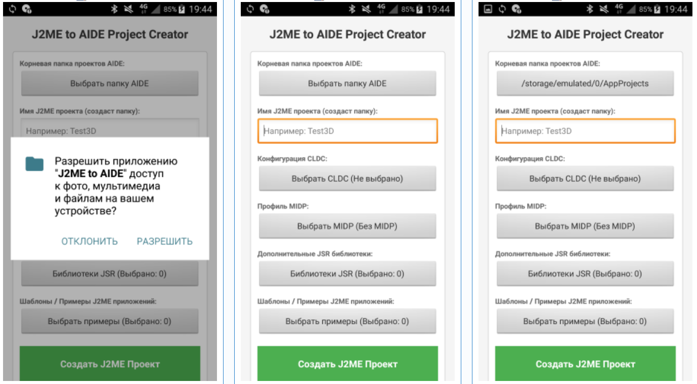
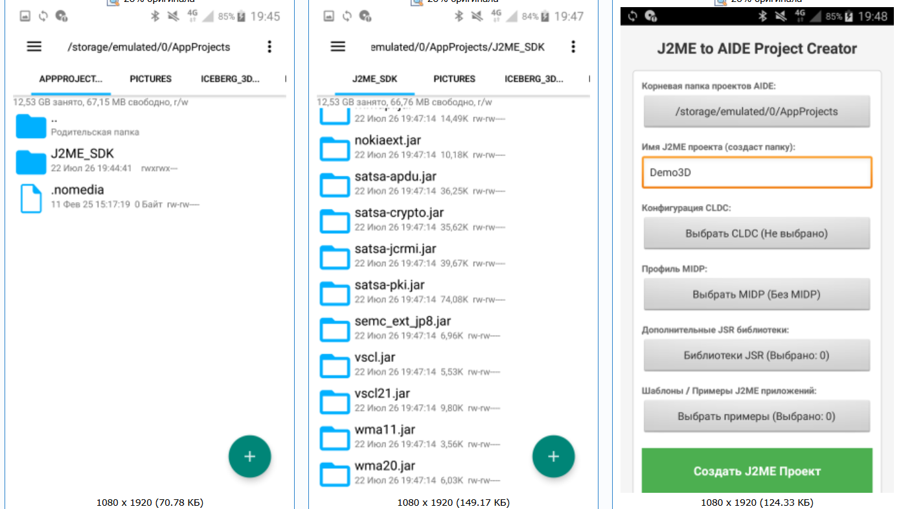
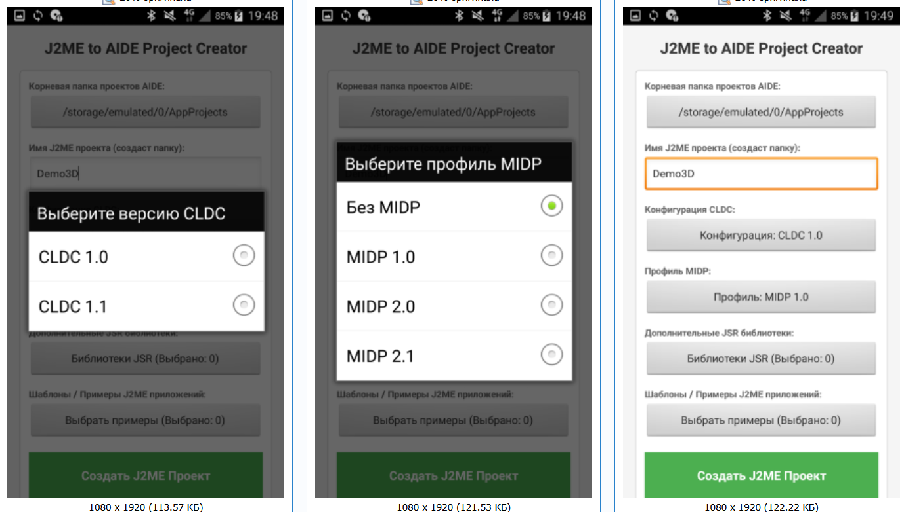
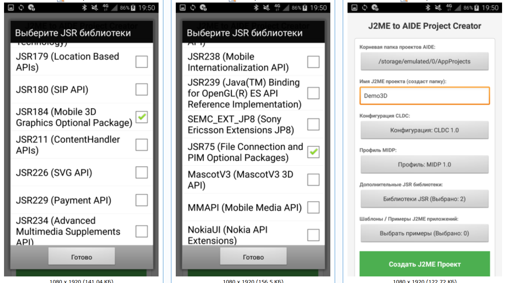
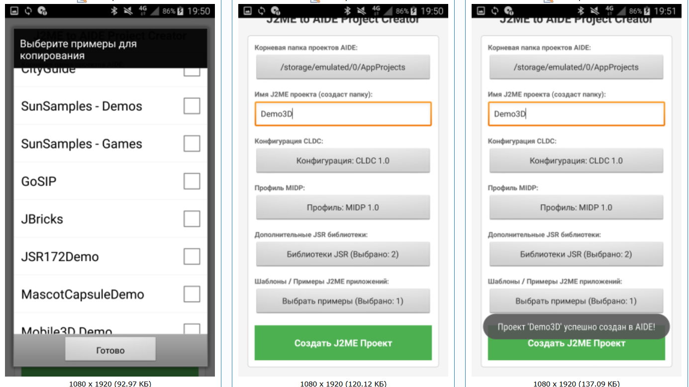
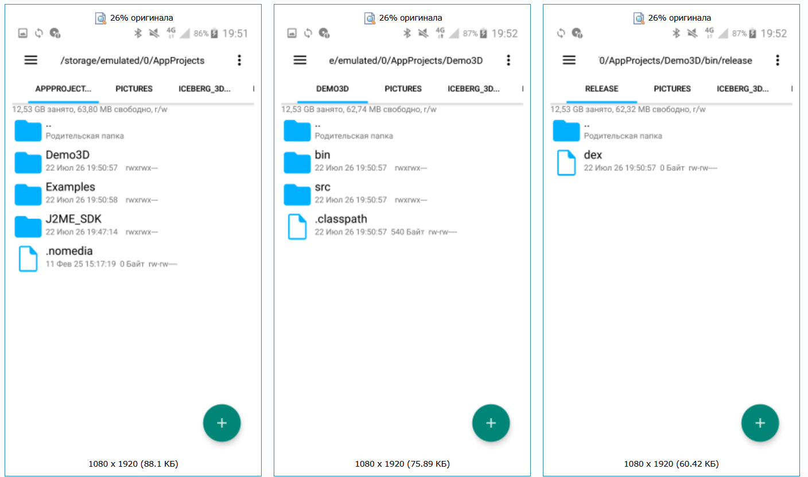
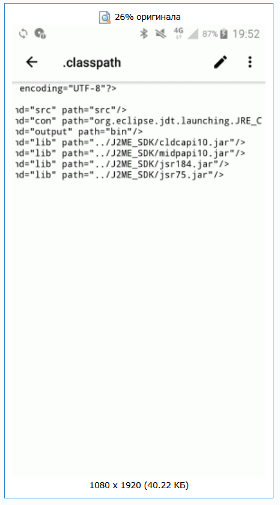
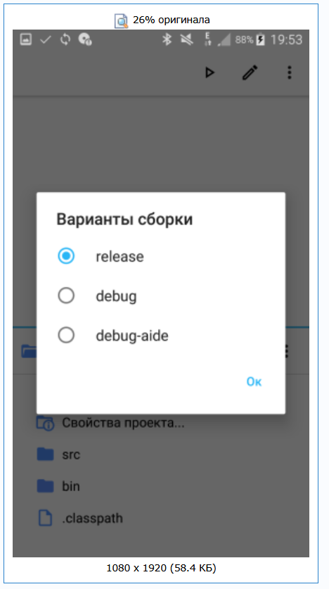
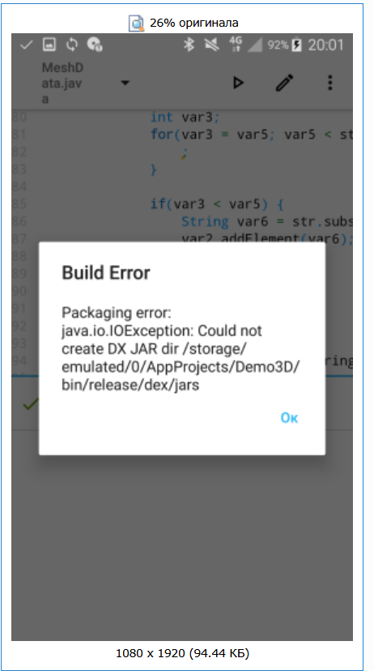

# J2MEtoAIDE
Приложение для Android, для удобного  создания J2ME проектов которые компилируются через AIDE (Android IDE).
## Приложение включает в себя:
1. Создания проекта J2ME с файлом .classpath, в папке проекта создаются папки:
 * src
 * bin
 * В папке bin создается папка release
 * в папке release создается файл dex, для того чтобы AIDE не создавал файлы .dex рядом с классами 
2. С выбором версии CLDC 1.0 или CLDC 1.1 (в. classpath записываются выбранные библиотеки)
3. С выбором MIDP: "Без MIDP", "MIDP 1.0", "MIDP 2.0", "MIDP 2.1"
4. С выбором дополнительных JSR Библиотек
5. С выбором Примеров/Шаблонов (от состава WTK)
* Очень удобное приложение (дополнение к Android IDE) для J2ME разработчиков которые используют AIDE в качестве редактора java кода и компилятора java.

* При первом запуске нужно указать корневую папку AIDE (обычно это AppProjects) и выбранная папка будет сохранена, потом он проверяет наличии jar библиотек в папке J2ME_SDK, если она пуста то приложение автоматики распакововает из apk файла.
* Удобнее чем https://4pda.to/forum/index.php?showtopic=319369&view=findpost&p=134121582
* P.S Лично я использую https://4pda.to/forum/index.php?showtopic=319369&view=findpost&p=85109127
 
 
 
 
 
 
 
 
 

Инструкция

 1. В поле "Имя J2ME Проекта" вводите имя вашего проекта
 2. Выбираете Конфигурацию CLDC (1.0 или 1.1)
 3. Выбираете Профиль MIDP (Без MIDP (для консольных j2me проектов), 1.0, 2.0 или 2.1)
 4. Выбираете дополнительные JSR библиотеки (Например jsr184)
 5. По желанию можно выбрать примеры/шаблоны (они будут скопированы в папку Examples)
 6. Нажимаете на кнопку "Создать J2ME Проект".
 В папке с проектами AIDE будет создана папка с именем вашего проекта, внутри нее будут папки src (исходники) и bin и файл .classpath, внутри папки bin будет папка release, внутри нее будет файл dex (для того чтобы AIDE при компиляции не создавала папку dex с преобразоваными jar библиотек (всю папку J2ME_SDK, займет много времени при сборке) в classes.dex и не создовала рядом с скомпилироваными class файлами dex файлы).
В файле .classpath будут записаны все подключенные библиотеки которые выбрали, включая выбранный cldc и выбранный midp, именно с этого файла AIDE распознает папку как проект.
 7. Откройте AIDE и найдите свой проект, в свойствах проекта выберите release (по умолчанию стоит debug).
 Когда будете компилировать свой проект, в конце успешной компиляции будет ошибка создания dex файлов, это нормально так как для j2me нужны толко class файлы.

